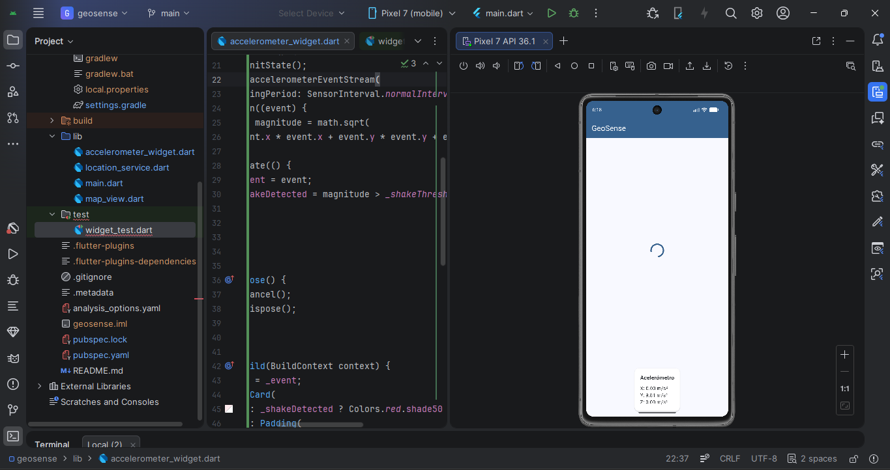

# GeoSense — Ubicación, Mapas y Sensores

Aplicación Flutter desarrollada para la Unidad 7 de Aplicaciones Móviles (UDES 2026).
Integra acceso a ubicación, visualización de mapas con geofencing y lectura del acelerómetro.

## Prerrequisitos

- Flutter SDK 3.19+ (Dart 3.3+)
- Android SDK API 26 mínimo
- Android Studio
- Google Maps API Key activa en Google Cloud Console

## Configuración de la API Key

1. Ve a [Google Cloud Console](https://console.cloud.google.com)
2. Crea un proyecto o usa uno existente
3. Habilita **Maps SDK for Android**
4. Ve a **Credenciales → Crear clave de API**
5. Copia la clave y pégala en `android/app/src/main/AndroidManifest.xml`:

```xml

```

## Cómo correr el proyecto

```bash
flutter pub get
flutter run
```

## Simular ubicación en el emulador

1. Abre el emulador en Android Studio
2. Click en los tres puntos `...` (Extended Controls)
3. Ve a **Location**
4. Ingresa latitud `7.8939` y longitud `-72.5078` (Cúcuta)
5. Click **Set Location**
6. La app pedirá permiso de ubicación al iniciar

## Simular agitación del acelerómetro

1. En Extended Controls ve a **Virtual sensors**
2. Mueve los controles de acelerómetro hasta superar 15 m/s²
3. La tarjeta cambiará a color rojo con el mensaje **¡Agitación detectada!**

## Estructura del proyecto
lib/
├── main.dart                  # Punto de entrada y HomeScreen
├── location_service.dart      # Servicio de ubicación y permisos
├── map_view.dart              # Widget del mapa con geofencing
└── accelerometer_widget.dart  # Widget del acelerómetro

## Capturas de pantalla

